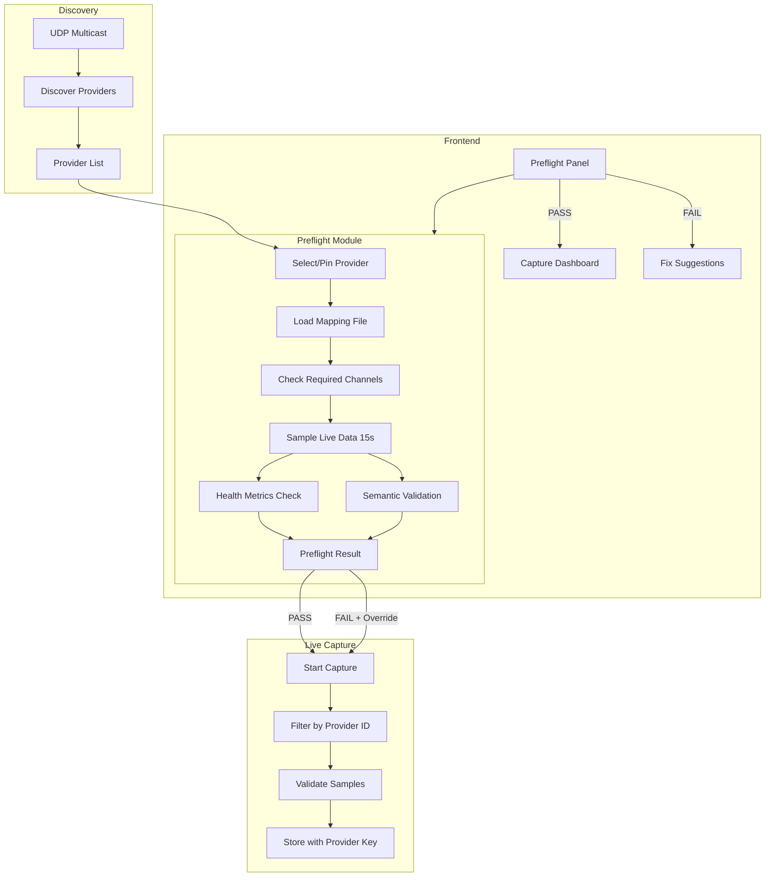

# JetDrive Preflight and Data Integrity System

## Phase 1: Provider Scoping + Preflight Module

### 1.1 Provider-Scoped Channel Identity

**Problem**: Currently channels are keyed by `channel_name` only in [`api/routes/jetdrive.py`](api/routes/jetdrive.py) (line 1894), and validation in [`api/services/jetdrive_validation.py`](api/services/jetdrive_validation.py) (line 202) tracks by `channel_id` only. Multiple providers with overlapping channel IDs/names cause silent collisions.

**Changes**:

- Update `JetDriveDataValidator._metrics` to key by `(provider_id, channel_id)` tuple
- Update `channel_values` dict in live capture to key by `f"{provider_id}_{channel_name}"`
- Add `active_provider_id` field to capture session state
- Filter/reject frames from non-active providers in `on_sample()` callback

**Files to modify**:

- [`api/services/jetdrive_validation.py`](api/services/jetdrive_validation.py) - Change `_metrics: dict[int, ChannelMetrics]` to `dict[tuple[str, int], ChannelMetrics]`
- [`api/routes/jetdrive.py`](api/routes/jetdrive.py) - Update `_live_capture_loop()` to pin provider and reject others

### 1.2 Preflight Module

**New file**: `api/services/jetdrive_preflight.py`

```python
@dataclass
class PreflightResult:
    passed: bool
    provider_id: str | None
    checks: list[PreflightCheck]  # Each check has name, passed, message, fix_suggestion
    missing_channels: list[str]
    suspected_mislabels: list[MislabelSuspicion]
    can_override: bool  # True for advisory mode
```

**Preflight checks**:

1. **Connectivity**: Provider discovered, responsive
2. **Required channels**: RPM, at least one AFR (front/rear/combined)
3. **Recommended channels**: MAP, TPS, Torque, Power
4. **Health thresholds**: Freshness < 2s, rate > 5 samples/sec, drop rate < 10%
5. **Semantic validation** (configurable, ~15s sample):

   - RPM in plausible range (500-12000), not frozen
   - AFR in plausible range (10-20 for gasoline)
   - TPS bounded 0-100
   - Power/Torque/RPM relationship (if all three present)

**New endpoint**: `POST /api/jetdrive/preflight/run`

```python
@jetdrive_bp.route("/preflight/run", methods=["POST"])
def run_preflight():
    provider_id = request.args.get("provider_id")  # Optional, auto-discover if not specified
    mode = request.args.get("mode", "blocking")  # "blocking" or "advisory"
    sample_seconds = int(request.args.get("sample_seconds", 15))
    # Returns PreflightResult
```

**Files to create**:

- [`api/services/jetdrive_preflight.py`](api/services/jetdrive_preflight.py) - Preflight logic
- [`tests/api/test_jetdrive_preflight.py`](tests/api/test_jetdrive_preflight.py) - Tests with synthetic streams

### 1.3 Preflight UI (Basic)

**New component**: `frontend/src/components/jetdrive/PreflightCheckPanel.tsx`

- "Run Preflight" button
- Checklist display with pass/fail icons
- If failed: show missing channels, suspected mislabels, and "Likely fix" suggestions
- Override button (if advisory mode enabled)

**Integration**: Add to [`frontend/src/components/jetdrive/HardwareTab.tsx`](frontend/src/components/jetdrive/HardwareTab.tsx) or as a modal before capture start.

---

## Phase 2: Persistent Mapping + Transforms (Future)

### 2.1 Provider Signature

Generate a unique signature for each provider configuration:

```python
def compute_provider_signature(provider: JetDriveProviderInfo) -> str:
    channel_hash = hashlib.sha256(
        json.dumps(sorted([
            {"id": c.chan_id, "name": c.name, "unit": c.unit.value}
            for c in provider.channels.values()
        ]), sort_keys=True).encode()
    ).hexdigest()[:12]
    return f"{provider.provider_id}_{provider.host}_{channel_hash}"
```

### 2.2 Mapping File Structure

**Location**: `config/jetdrive_mappings/<provider_signature>.json`

```json
{
  "version": "1.0",
  "provider_signature": "dynojet_192.168.1.50_a1b2c3d4e5f6",
  "provider_id": "dynojet",
  "host": "192.168.1.50",
  "created_at": "2026-01-27T21:00:00Z",
  "channels": {
    "rpm": { "source_id": 42, "source_name": "Digital RPM 1" },
    "afr_front": { "source_id": 15, "source_name": "Air/Fuel Ratio 1" },
    "afr_rear": { "source_id": 16, "source_name": "Air/Fuel Ratio 2" },
    "map_kpa": { "source_id": 20, "source_name": "MAP kPa" },
    "torque": { "source_id": 3, "source_name": "Torque", "transform": "nm_to_ftlb" },
    "power": { "source_id": 4, "source_name": "Horsepower", "transform": "kw_to_hp" },
    "lambda_front": { "source_id": 17, "transform": "lambda_to_afr" }
  }
}
```

### 2.3 Mapping API Endpoints

- `GET /api/jetdrive/mapping/<provider_signature>` - Get mapping for provider
- `PUT /api/jetdrive/mapping/<provider_signature>` - Save/update mapping
- `GET /api/jetdrive/mapping/templates` - List known-good templates (Dynojet, Mustang, etc.)
- `POST /api/jetdrive/mapping/import-template` - Import a template as starting point

### 2.4 Mapping UI

- Channel discovery display: "Provider is broadcasting these channels: [list]"
- Drag-and-drop or dropdown mapping interface
- Transform selection (lambda→AFR, Nm→ft-lb, kW→HP)
- Validation on save (channel IDs must exist)

---

## Architecture Diagram



---

## Test Strategy

### Unit Tests

- Two-provider collision test: same channel IDs, different values, verify no cross-contamination
- Preflight pass/fail with synthetic sample streams
- Semantic check edge cases (frozen RPM, out-of-range AFR)

### Integration Tests

- Full preflight → capture → CSV output flow
- Mapping file load/save roundtrip
- Provider signature change detection (forces re-mapping)

---

## File Summary

**Phase 1 - Create**:

- `api/services/jetdrive_preflight.py`
- `frontend/src/components/jetdrive/PreflightCheckPanel.tsx`
- `tests/api/test_jetdrive_preflight.py`

**Phase 1 - Modify**:

- `api/services/jetdrive_validation.py` - Provider-scoped metrics
- `api/routes/jetdrive.py` - Provider pinning, preflight endpoint
- `frontend/src/components/jetdrive/HardwareTab.tsx` - Add PreflightCheckPanel

**Phase 2 - Create** (future):

- `api/services/jetdrive_mapping.py`
- `config/jetdrive_mappings/` directory
- `frontend/src/components/jetdrive/ChannelMappingPanel.tsx`