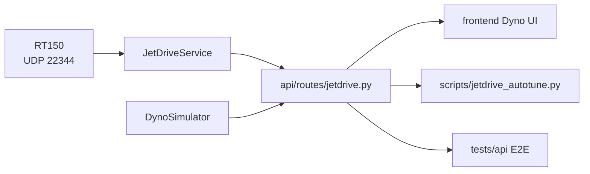

# RT-150 Live Run Milestone (Ship this Week)

Using the RT-150 reference config and network details (192.168.1.115 via UDP 22344) and drum parameters in `config/dynoware_rt150.json` [[memory:12184876]].

## Scope

- Backend JetDrive connection, run control, and streaming validation.
- Simulator fallback for offline dev.
- Minimal UI to connect, start/stop, and view live telemetry/errors.
- Smoke script and E2E tests (simulator-backed) pre-live.
- Security scans and release packaging.

## Key Files

- Backend: [`api/routes/jetdrive.py`](api/routes/jetdrive.py), [`api/services/dyno_simulator.py`](api/services/dyno_simulator.py), [`api/config.py`](api/config.py)
- Config: [`config/dynoware_rt150.json`](config/dynoware_rt150.json)
- Frontend: [`frontend/src/components/jetdrive/DynoConfigPanel.tsx`](frontend/src/components/jetdrive/DynoConfigPanel.tsx)
- Scripts: [`scripts/jetdrive_autotune.py`](scripts/jetdrive_autotune.py)
- Tests: `tests/api/` (add new E2E)
- Versioning: [`dynoai/version.py`](dynoai/version.py)

## Data Flow

## Deliverables

- Live connect/start/stop/status verified against RT-150 hardware.
- Real-time telemetry (RPM, torque, HP) visible in UI; error states handled.
- Simulator fallback flag for offline testing.
- Smoke script to verify path end-to-end.
- E2E simulator tests passing in CI.
- Snyk scans clean post-changes; version bumped and notes published.

## Acceptance Criteria

- Connect to 192.168.1.115, receive packets reliably; reconnection logic works.