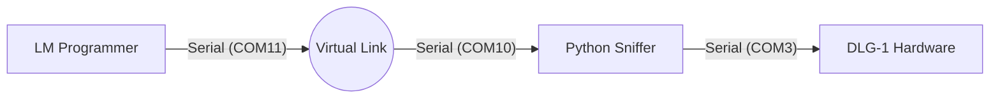

# Reverse Engineering Innovate DLG-1 Configuration Protocol

Since the Innovate "ISP2" protocol documentation only covers logging (reading data), and not configuration (programming fuel types, output scaling, etc.), we need to reverse engineer the commands sent by the **LM Programmer** software.

## The Strategy: "Man-in-the-Middle" Attack

We will place a Python script between the **LM Programmer** software and the **DLG-1** hardware to intercept and log the traffic.

### Architecture



### Prerequisites

1.  **Python 3.x** installed.
2.  **pyserial** installed (`pip install pyserial`).
3.  **com0com** (or similar Virtual Serial Port Driver).
    - Download: [SourceForge - com0com](https://sourceforge.net/projects/com0com/) (or use a signed alternative for Windows 10/11 like "Virtual Serial Port Driver" trial).
    - **Note**: On modern Windows 10/11, com0com requires disabling Secure Boot or enabling "Test Signing Mode" because it is an unsigned driver.
    - **Alternative**: Use two physical USB-Serial adapters connected with a Null Modem cable (TX<->RX), but software virtual ports are easier if you can install them.

### Step-by-Step Guide

#### 1. Setup Virtual Ports
1.  Install `com0com`.
2.  Open the Setup Command Prompt for com0com.
3.  Create a pair of ports, e.g., `CNCA0` (PortName=COM10) and `CNCB0` (PortName=COM11).
4.  Verify they appear in Device Manager.

#### 2. Identify Real Port
1.  Plug in your DLG-1.
2.  Check Device Manager for its COM port (e.g., `COM3`).

#### 3. Run the Sniffer
Run the script `scripts/innovate_sniffer.py`. We tell it to connect to the **Real** device (`COM3`) and one side of the **Virtual** pair (`COM10`).

```powershell
cd C:\Dev\DynoAI_3
python scripts/innovate_sniffer.py --real COM3 --app COM10
```

#### 4. Configure LM Programmer
1.  Open **LM Programmer**.
2.  It might auto-scan. If it doesn't find it, look for settings to specify the port.
3.  Select **COM11** (the *other* side of the virtual pair).
4.  LM Programmer talks to COM11 -> COM10 -> Python -> COM3 -> DLG-1.

#### 5. Capture Data
1.  Watch the Python console. You should see "Handshake" packets.
2.  In LM Programmer, change a setting (e.g., Change Fuel Type to Methanol).
3.  Click **Program**.
4.  **Copy the HEX output** from the Python console.

### What We Are Looking For

We expect to see specific byte sequences.

**Example (Hypothetical):**
```
APP -> DEV | HEX: A5 5A 02 01 FF ...  (Command Header?)
DEV -> APP | HEX: A5 5A 00 ...        (Acknowledge)
```

Once we have these logs, we can update `api/services/innovate_client.py` to implement a `configure_device()` method.

## Alternative: PortMon / Serial Port Monitor

If you cannot install `com0com`, you can use a software sniffer tool:
1.  **Serial Port Monitor** (Eltima/Electronic Team) - Has a trial.
2.  **Device Monitoring Studio**.
3.  **SysInternals PortMon** (Only works on old Windows, usually fails on Win10/11).

If you use one of these:
1.  Start the sniffer.
2.  Start LM Programmer.
3.  Program the device.
4.  Export the log to Text/HTML.
5.  Share the log file.

